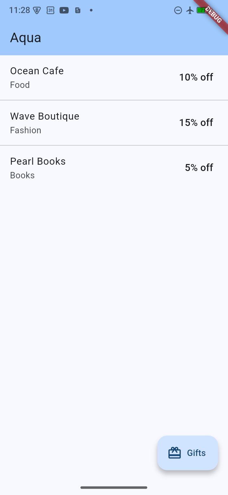
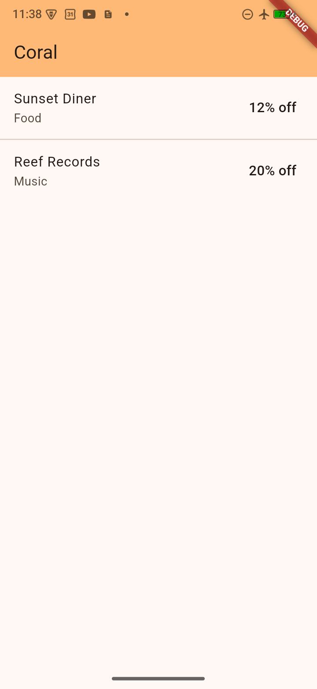
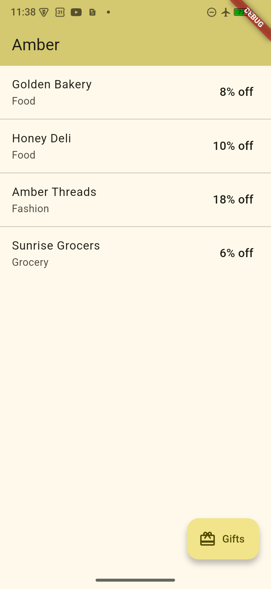

# flutter_white_label_template

**One Flutter codebase → N branded apps.** A showcase template for the
white-label / OEM pattern: three fictional brands share a single codebase but
differ in identity, theme, feature flags, and mock data — all driven by a
compile-time `--dart-define`.

> Product story: a local perks / rewards platform, co-branded per region.

---

## The three brands

| Aqua | Coral | Amber |
|:---:|:---:|:---:|
|  |  |  |
| Blue theme • 3 stores • Gifts **ON** | Orange theme • 2 stores • Gifts **OFF** | Yellow theme • 4 stores • Gifts **ON** |

Same codebase. Different colors, different merchant catalogs, and — the key
demo — a **feature flag** (`giftEnabled`) that hides the Gifts button for
Coral. No brand-specific code anywhere.

---

## The golden rule

> Feature code checks **capabilities**, never brand names.

```dart
// ✅ good
if (config.giftEnabled) { showGiftsButton(); }

// ❌ bad — never do this
if (brand == Brand.coral) { hideGiftsButton(); }
```

Adding a fourth brand requires **zero UI changes** — only config plus platform
plumbing (see [Add a 4th brand](#add-a-4th-brand)).

---

## Quick start

```sh
flutter pub get

# default brand (aqua)
flutter run

# pick a brand at build time
flutter run --dart-define=BRAND=coral
flutter run --dart-define=BRAND=amber

# target a specific device
flutter devices
flutter run -d <device-id> --dart-define=BRAND=coral
```

In **Cursor / VS Code**, use the `Brand: aqua`, `Brand: coral`, or
`Brand: amber` entries in the Run & Debug panel — they pass the dart-define
for you.

---

## Test

```sh
flutter test                                # full suite (12 tests)
flutter test test/store_repository_test.dart
flutter test test/providers_test.dart
flutter test test/screens/home_screen_test.dart
```

Three layers: **unit** (repo), **provider** (Riverpod DI, iterates
`Brand.values`), **widget** (HomeScreen — the key coral test asserts the
Gifts FAB is absent, proving the golden rule end-to-end).

See [`docs/TESTING.md`](docs/TESTING.md) for the full strategy, examples,
Maestro flows, coverage commands, and how to add tests for a new brand.
Latest run snapshot: [`docs/TEST_RESULTS.md`](docs/TEST_RESULTS.md).

---

## Architecture

```
lib/
├── brand/
│   ├── brand.dart              # enum Brand { aqua, coral, amber }
│   │                           # currentBrand resolved from --dart-define
│   └── brand_config.dart       # BrandConfig + const brandConfigs map
├── models/
│   └── store.dart              # Store model
├── repositories/
│   └── store_repository.dart   # fake 800 ms latency, per-brand data
├── providers/
│   ├── brand_providers.dart    # @riverpod brand + brandConfig
│   └── store_providers.dart    # @riverpod storeRepository + stores
├── screens/
│   └── home_screen.dart        # ConsumerWidget, capability-gated FAB
└── main.dart                   # ProviderScope + themed MaterialApp
```

Providers use **[Riverpod code generation](https://riverpod.dev/docs/concepts/about_code_generation)**
(`@riverpod` annotations + `riverpod_generator`). Regenerate after editing:

```sh
dart run build_runner build
# or watch mode while developing
dart run build_runner watch
```

**Compile-time brand selection** — `String.fromEnvironment('BRAND')` is
resolved by the compiler, so unused brand configs can be tree-shaken from
release builds.

**Runtime testability** — providers can be overridden in tests, so brand
switching doesn't require rebuilding.

**No brand branches in UI code** — every runtime decision reads from
`BrandConfig` (colors, names, feature flags). The golden-rule check is
documented on the FAB in `screens/home_screen.dart`.

---

## Add a 4th brand

Roughly 15 minutes end-to-end. Say you want to add `pearl`:

- [ ] Add `pearl` to the `Brand` enum in `lib/brand/brand.dart`
- [ ] Add a `pearl` entry to `brandConfigs` (seed color, app name, gifts on/off)
- [ ] Add store list to `_storesByBrand` in `lib/repositories/store_repository.dart`
- [ ] Android: add `pearl { }` to `productFlavors` in `android/app/build.gradle`
- [ ] iOS: add `pearl.xcconfig` + build configurations + shared scheme in Xcode
- [ ] CI: add `pearl` to the workflow matrix
- [ ] `.vscode/launch.json`: add a `Brand: pearl` launch config

Provider tests are parameterized over `Brand.values`, so they cover the new
brand automatically.

---

## Stack

- Flutter (stable), Dart 3
- [`flutter_riverpod`](https://pub.dev/packages/flutter_riverpod) +
  [`riverpod_annotation`](https://pub.dev/packages/riverpod_annotation) —
  code-generated providers, DI, override-based testing
- Material 3 with `ColorScheme.fromSeed(config.seedColor)` for per-brand theming
- Android product flavors *(in progress)*
- iOS xcconfig + shared schemes *(in progress)*
- GitHub Actions matrix builds *(in progress)*

---

## Roadmap

| # | Step | Status |
|---|---|:---:|
| 1 | Initial Flutter project scaffold | ✅ |
| 2 | Brand config layer via `--dart-define` | ✅ |
| 3 | Mock per-brand store repository + unit test | ✅ |
| 4 | Riverpod providers + override test | ✅ |
| 5 | Brand-agnostic home screen | ✅ |
| 6 | Android product flavors (side-by-side installable apps) | ⏳ |
| 7 | iOS xcconfig + shared schemes | ⏳ |
| 8 | CI matrix build + polished docs | ⏳ |

---

## Related

- [`dinkar1708/flutter_riverpod_template`](https://github.com/dinkar1708/flutter_riverpod_template)
  — the companion Riverpod starter (single-brand)

## License

See [LICENSE](LICENSE).
